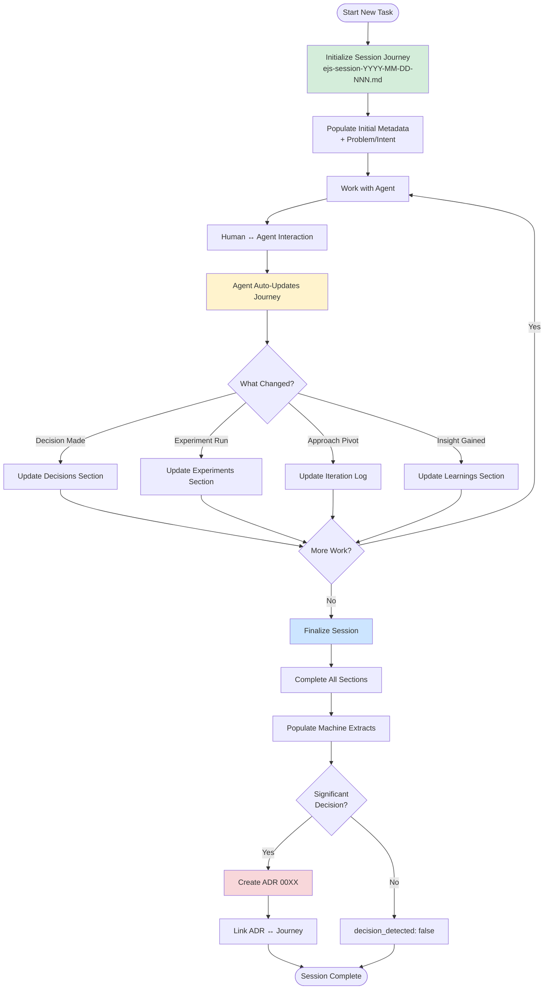

# Engineering Journey System (EJS)

Starter repository for the Engineering Journey System.

## Why This Exists

Traditional ADRs are great at recording the *final decision*, but modern development (especially human+AI collaboration) includes a lot of valuable context that usually disappears:

- The prompt/response trail and the “why” behind changes
- Experiments tried, evidence observed, and iterations/pivots
- Trade-offs considered but not chosen
- Agent influence vs. human overrides/corrections

EJS exists to capture that reality with **low friction** and **high auditability**:

- **One Session Journey per session** (initialized at start, updated throughout, finalized at end) to preserve collaboration + evidence + learning in real-time.
- **ADRs only when significant** (conditional, numbered) to keep the ADR ledger curated.
- A **repo-portable, tool-agnostic** structure so the same workflow works in GitHub web, VS Code, and across teams.

Includes:
- `.github/agents/ejs-journey.agent.md` — Copilot custom agent profile (canonical)
- `.github/skills/ejs-session-wrapup/SKILL.md` — Copilot Agent Skill (canonical)
- `.github/copilot-instructions.md` — Copilot repo-wide instructions (recommended)
- `.github/ejs-agent.md` — legacy pointer (compat)
- `.github/ejs-session-skill.md` — legacy pointer (compat)
- `ejs-docs/adr/0000-adr-template.md` — ADR template for structured journey capture
- `ejs-docs/adr/0010-engineering-journey-system-adoption.md` — example ADR
- `.github/copilot/pull_request_template.md` — PR template with EJS checks
- `ejs-docs/journey/_templates/journey-template.md` — Session Journey template

## Purpose

EJS captures:
- human + AI collaboration
- learning and decision evolution
- reusable knowledge for future agents
- cross-platform engineering memory

## How to Use

### Visual Overview
A quick visual flowchart to show the new flow:

### Data Flows

To see the data flow of how this works both in a **single user and agent interaction** and a **multi-agent / sub-agent ineraction** check the [Session Lifecycle Patterns](https://github.com/McFuzzySquirrel/Engineering-Journey-System/blob/main/ejs-docs/agent-memory/session-lifecycle-patterns.md)

### New Session-Lifecycle Approach (Recommended)

1. **At session start**, initialize the Session Journey:
   - Agent creates `ejs-docs/journey/YYYY/ejs-session-YYYY-MM-DD-<seq>.md`
   - Initial metadata and problem/intent are captured
   - Structure is ready for continuous updates

2. **During the session**, work with your coding agent as usual:
   - Agent continuously updates the Session Journey as work progresses
   - Interactions, experiments, learnings captured in real-time
   - No need to remember details for end-of-session reconstruction

3. **At session end**, finalize the journey:
   - Agent completes all sections with coherent summaries
   - Machine extracts are populated
   - Agent drafts a numbered ADR only if a significant architecture/design decision occurred

4. **Review and commit** artifacts:
   - Verify Session Journey completeness
   - Review ADR if created
   - Include links in PR template

### Why This Approach?

**Incremental capture throughout the session** produces better documentation than end-of-session reconstruction:
- Context preserved when fresh (not from memory)
- Accurate collaboration trail (recorded as it happens)
- Reduced end-of-session burden (most work already done)
- Higher quality documentation (real-time vs. retrospective)
- Better for multi-step/multi-agent sessions (preserves full history)

### Make It “Fire” on Commit/Push

Agents can’t reliably detect `git commit`/`git push` on their own across editors and platforms. The portable way to make EJS run every time is to add lightweight git hook reminders.

This repo includes hooks that remind (and optionally block) when you commit/push without a Session Journey.

Install them (per-repo):

`./scripts/install-githooks.sh`

Windows (PowerShell):

`powershell -ExecutionPolicy Bypass -File .\scripts\install-githooks.ps1`

Behavior:
- `post-commit`: reminds if the last commit didn’t include an `ejs-docs/journey/YYYY/ejs-session-...md` file.
- `pre-push`: warns if the push doesn’t include a Session Journey file (set `EJS_ENFORCE=1` to block pushes).

Notes:
- On Windows, this relies on Git for Windows (Git Bash) to run hook scripts.

Bypass:
- `git commit --no-verify` / `git push --no-verify`
- or set `EJS_SKIP=1`

## Tooling integration (Copilot, Claude, Cursor)

EJS is tool-agnostic. For GitHub Copilot, the canonical, auto-discoverable locations are:
- `.github/agents/ejs-journey.agent.md` (custom agent profile)
- `.github/skills/ejs-session-wrapup/SKILL.md` (Agent Skill)

Legacy human-readable pointers (kept for compatibility):
- `.github/ejs-agent.md`
- `.github/ejs-session-skill.md`

Different agent tools auto-load instructions from different filenames. Recommended mapping:

### GitHub Copilot (primary)

- Repo-wide instructions: `.github/copilot-instructions.md`.
- Custom agent profiles: `.github/agents/*.agent.md` (selectable from the Copilot agent dropdown).
- Agent Skills: `.github/skills/<skill-name>/SKILL.md` (loaded by Copilot when relevant to the prompt/description).

This repo includes:
- `.github/agents/ejs-journey.agent.md`
- `.github/skills/ejs-session-wrapup/SKILL.md`

Important: agents/skills don’t automatically trigger on `git commit`/`git push` events. They’re selected (agent profiles) or injected (skills) based on the chat context. For “fire on commit/push,” use the git hooks.

### Claude (e.g., Claude Code)

- Use `CLAUDE.md` at the repository root.
- Same approach: reference `.github/agents/ejs-journey.agent.md` and `.github/skills/ejs-session-wrapup/SKILL.md`.

### Cursor

- Use either `.cursorrules` at the repository root (common/simple), or Cursor “rules” under `cursor/rules/` (newer setups).
- Reference `.github/agents/ejs-journey.agent.md` and `.github/skills/ejs-session-wrapup/SKILL.md` and keep any Cursor-specific constraints separate.

## Using EJS in VS Code

If you work primarily in VS Code, you can use the same custom agent + skill files.

### Custom agent (recommended)

- Open GitHub Copilot Chat.
- Use the agent dropdown to select `ejs-journey`.
- If you don’t see it, use the agent dropdown → “Configure Custom Agents…” and ensure the workspace agent profile exists at `.github/agents/ejs-journey.agent.md`.

### Skill (session management)

Agent Skills support is evolving across Copilot surfaces. If your VS Code/Copilot build supports skills, Copilot can load `.github/skills/ejs-session-wrapup/SKILL.md` when relevant.

If skills aren't loading automatically, you can still get the same behavior by explicitly prompting:

**At session start:**
- "Initialize session"
- "Let's start working on [task]"
- "Create session journey"

**During session:**
- The agent automatically updates the Session Journey as work progresses

**At session end:**
- "Wrap up this session"
- "Finalize journey"
- "Use the ejs-session-wrapup skill and wrap up this session"

### Commit/push reminders

VS Code doesn’t change the git hook behavior. If you copy the optional `.githooks/` + install scripts into your repo and install them, you’ll still get reminders on `git commit` and `git push`.

## Adopt EJS in another repository (copy/paste kit)

If you’re copying this into an existing repo (e.g., photo-jumper), copy the files below. This repo uses a strict, collision-resistant docs root: `ejs-docs/`.

### Minimal copy (recommended)

- `.github/agents/ejs-journey.agent.md`
- `.github/skills/ejs-session-wrapup/SKILL.md`
- `.github/copilot-instructions.md` (recommended)
- `ejs-docs/journey/_templates/journey-template.md`
- `ejs-docs/adr/0000-adr-template.md`

Do not copy any existing `ejs-docs/journey/YYYY/` files from this starter repo into your target repo. Those are session artifacts; your target repo should generate its own.

### Optional (nice-to-have)

- `.github/copilot/pull_request_template.md` (PR checklist)
- `ejs-docs/agent-memory/` (prompt/pattern reference library)
- `ejs-docs/adr/0010-engineering-journey-system-adoption.md` (example ADR)

If you copy example ADRs, treat them as reference material (not “your repo’s decisions”).

### Optional (commit/push reminders)

These make the process “fire” on `git commit`/`git push`:

- `.githooks/` (the hooks themselves)
- `scripts/install-githooks.sh`
- `scripts/install-githooks.ps1`

After copying, install hooks in the target repo:

- Linux/macOS: `./scripts/install-githooks.sh`
- Windows: `powershell -ExecutionPolicy Bypass -File .\scripts\install-githooks.ps1`

### Resulting layout (target repo)

.github/
├─ agents/
│  └─ ejs-journey.agent.md
├─ skills/
│  └─ ejs-session-wrapup/
│     └─ SKILL.md
├─ copilot/
│  └─ pull_request_template.md
└─ copilot-instructions.md
ejs-docs/
├─ adr/
│  └─ 0000-adr-template.md
└─ journey/
   └─ _templates/
      └─ journey-template.md

### What to do in GitHub web (your next step)

- Make sure the copied files are committed and merged to the target repo's default branch (so GitHub web can discover the agent/skill).
- Start a Copilot coding session and select the `ejs-journey` custom agent.
- **At session start**, say: "Initialize session" or "Let's start working on [task]" to create the initial Session Journey.
- Work normally throughout the session. The agent will continuously update the Session Journey as you collaborate.
- **At session end**, say: "Wrap up this session" or "Finalize journey" to complete the Session Journey.
- Expect outputs under:
  - `ejs-docs/journey/YYYY/ejs-session-YYYY-MM-DD-<seq>.md` (created at start, updated throughout, finalized at end)
  - `ejs-docs/adr/NNNN-<kebab-title>.md` (only if decision rubric triggers)

