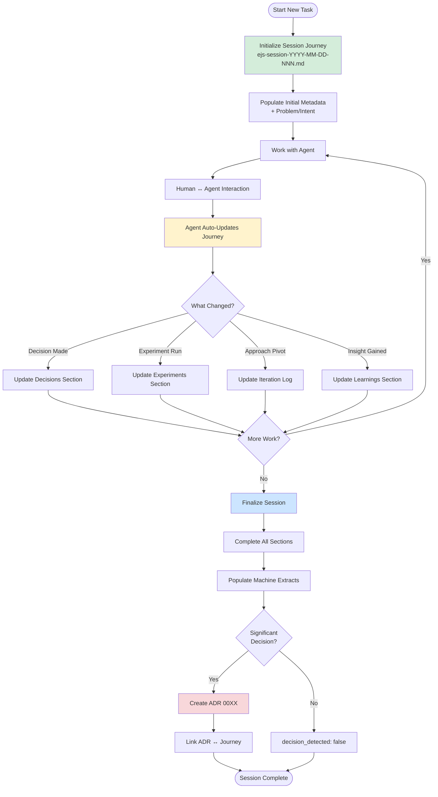

# Engineering Journey System (EJS)

Starter repository for the Engineering Journey System.

## Why This Exists

Traditional ADRs are great at recording the *final decision*, but modern development (especially human+AI collaboration) includes a lot of valuable context that usually disappears:

- The prompt/response trail and the “why” behind changes
- Experiments tried, evidence observed, and iterations/pivots
- Trade-offs considered but not chosen
- Agent influence vs. human overrides/corrections

EJS exists to capture that reality with **low friction** and **high auditability**:

- **One Session Journey per session** (initialized at start, updated throughout, finalized at end) to preserve collaboration + evidence + learning in real-time.
- **ADRs only when significant** (conditional, numbered) to keep the ADR ledger curated.
- A **repo-portable, tool-agnostic** structure so the same workflow works in GitHub web, VS Code, and across teams.
- **Non-competing observer model** — EJS injects silent recording into whatever agents are already active in your repo. It never competes with or overrides existing agent instructions.

Includes:
- `.github/agents/ejs-journey.agent.md` — Copilot custom agent profile (observer + coordinator)
- `.github/copilot-instructions.md` — Always-on silent recording contract (append to your existing instructions)
- `ejs-docs/adr/0000-adr-template.md` — ADR template for structured journey capture
- `ejs-docs/adr/0010-engineering-journey-system-adoption.md` — example ADR
- `.github/copilot/pull_request_template.md` — PR template with EJS checks
- `ejs-docs/journey/_templates/journey-template.md` — Session Journey template
- `scripts/adr-db.py` — SQLite-backed index for ADRs and Session Journeys ([details below](#ejs-database-tool))
- `scripts/bootstrap-ejs.sh` — Bootstrap script to add EJS to any existing repo ([details below](#adopt-ejs-in-another-repository))
- `scripts/bootstrap-ejs.ps1` — PowerShell bootstrap script for Windows users ([details below](#adopt-ejs-in-another-repository))
- `game/` — 3D Asteroids game built with EJS sub-agents ([how to run](game/README.md))

## Purpose

EJS captures:
- human + AI collaboration
- learning and decision evolution
- reusable knowledge for future agents
- cross-platform engineering memory

## 3D Asteroids Game (EJS in Action)

The `game/` folder contains a fully playable **3D Asteroids** game built entirely through human + AI collaboration using EJS with sub-agents. It's a fun demonstration that the Engineering Journey System works end-to-end with multi-agent workflows — and the game is genuinely enjoyable to play!

See [`game/README.md`](game/README.md) for setup instructions and controls.

## EJS Database Tool

`scripts/adr-db.py` is a SQLite-backed index that lets agents (and humans) efficiently query ADRs and Session Journeys without reading every markdown file into context.

### Quick start

```bash
python scripts/adr-db.py sync          # Index all ADRs + journeys into .ejs.db
python scripts/adr-db.py summary       # Compact ADR digest (great for agent context)
python scripts/adr-db.py search "auth" # Full-text search across ADRs and journeys
```

### All commands

| Command | Description |
|---------|-------------|
| `sync` | Parse ADR and journey markdown files and upsert into the local SQLite database |
| `list` | List all ADRs (compact: id, title, status, date) |
| `get <adr_id>` | Show full details for a specific ADR |
| `search <query>` | Full-text search across all ADR **and** journey content |
| `summary` | Agent-friendly compact summary of all ADRs |
| `list-journeys` | List all Session Journeys (compact: id, date, decision status) |
| `get-journey <session_id>` | Show full details for a specific journey |
| `summary-journeys` | Agent-friendly compact summary of all journeys |

### How it works

- **Two tables** — `adrs` (18 columns) and `journeys` (16 columns) store extracted metadata and key content sections.
- **FTS5 full-text search** — virtual tables with auto-sync triggers enable fast concept-based queries across decisions, rationale, learnings, and session history.
- **No external dependencies** — uses Python stdlib `sqlite3`; PyYAML is optional for richer YAML frontmatter parsing.
- **Database is gitignored** — `.ejs.db` is a generated artifact. Run `sync` after cloning or when files change.

### Agent workflow

Agents should run `sync` at the start of a session to ensure the index is fresh, then use `summary`, `search`, or `get` to reference past decisions efficiently:

```bash
python scripts/adr-db.py sync && python scripts/adr-db.py summary
```

See [ADR 0013](ejs-docs/adr/0013-sqlite-backed-adr-index-for-agent-reference.md) for the full design rationale.

## How to Use

### Visual Overview
A quick visual flowchart to show the new flow:


```mermaid
flowchart TD
    Start([Start New Task]) --> Init[Initialize Session Journey<br/>ejs-session-YYYY-MM-DD-NNN.md]
    Init --> Metadata[Populate Initial Metadata<br/>+ Problem/Intent]
    Metadata --> Work[Work with Agent]
    
    Work --> Interact[Human ↔ Agent Interaction]
    Interact --> Auto[Agent Auto-Updates Journey]
    Auto --> Sections{What Changed?}
    
    Sections -->|Decision Made| DecSec[Update Decisions Section]
    Sections -->|Experiment Run| ExpSec[Update Experiments Section]
    Sections -->|Approach Pivot| IterSec[Update Iteration Log]
    Sections -->|Insight Gained| LearnSec[Update Learnings Section]
    
    DecSec --> MoreWork{More Work?}
    ExpSec --> MoreWork
    IterSec --> MoreWork
    LearnSec --> MoreWork
    
    MoreWork -->|Yes| Work
    MoreWork -->|No| Finalize[Finalize Session]
    
    Finalize --> Complete[Complete All Sections]
    Complete --> Extracts[Populate Machine Extracts]
    Extracts --> ADRCheck{Significant<br/>Decision?}
    
    ADRCheck -->|Yes| CreateADR[Create ADR 00XX]
    ADRCheck -->|No| NoADR[decision_detected: false]
    
    CreateADR --> Link[Link ADR ↔ Journey]
    Link --> Done([Session Complete])
    NoADR --> Done
    
    style Init fill:#d4edda
    style Auto fill:#fff3cd
    style Finalize fill:#cce5ff
    style CreateADR fill:#f8d7da
```
### Data Flows

To see the data flow of how this works both in a **single user and agent interaction** and a **multi-agent / sub-agent interaction** check the [Session Lifecycle Patterns](https://github.com/McFuzzySquirrel/Engineering-Journey-System/blob/main/ejs-docs/session-lifecycle-patterns.md)

### New Session-Lifecycle Approach (Recommended)

1. **At session start**, initialize the Session Journey:
   - Agent creates `ejs-docs/journey/YYYY/ejs-session-YYYY-MM-DD-<seq>.md`
   - Initial metadata and problem/intent are captured
   - Structure is ready for continuous updates

2. **During the session**, work with your coding agent as usual:
   - Agent continuously updates the Session Journey as work progresses
   - Interactions, experiments, learnings captured in real-time
   - No need to remember details for end-of-session reconstruction

3. **At session end**, finalize the journey:
   - Agent completes all sections with coherent summaries
   - Machine extracts are populated
   - Agent drafts a numbered ADR only if a significant architecture/design decision occurred

4. **Review and commit** artifacts:
   - Verify Session Journey completeness
   - Review ADR if created
   - Include links in PR template

### Why This Approach?

**Incremental capture throughout the session** produces better documentation than end-of-session reconstruction:
- Context preserved when fresh (not from memory)
- Accurate collaboration trail (recorded as it happens)
- Reduced end-of-session burden (most work already done)
- Higher quality documentation (real-time vs. retrospective)
- Better for multi-step/multi-agent sessions (preserves full history)

### Make It “Fire” on Commit/Push

Agents can’t reliably detect `git commit`/`git push` on their own across editors and platforms. The portable way to make EJS run every time is to add lightweight git hook reminders.

This repo includes hooks that remind (and optionally block) when you commit/push without a Session Journey.

Install them (per-repo):

`./scripts/install-githooks.sh`

Windows (PowerShell):

`powershell -ExecutionPolicy Bypass -File .\scripts\install-githooks.ps1`

Behavior:
- `post-commit`: reminds if the last commit didn’t include an `ejs-docs/journey/YYYY/ejs-session-...md` file.
- `pre-push`: warns if the push doesn’t include a Session Journey file (set `EJS_ENFORCE=1` to block pushes).

Notes:
- On Windows, this relies on Git for Windows (Git Bash) to run hook scripts.

Bypass:
- `git commit --no-verify` / `git push --no-verify`
- or set `EJS_SKIP=1`

## Tooling integration (Copilot, Claude, Cursor)

EJS is tool-agnostic and **non-competing** — it layers silent recording onto whatever agents are already active. For GitHub Copilot, the canonical, auto-discoverable location is:
- `.github/copilot-instructions.md` (always-on silent recording — Tier 1)
- `.github/agents/ejs-journey.agent.md` (explicit invocation — Tier 2/3)

Different agent tools auto-load instructions from different filenames. Recommended mapping:

### GitHub Copilot (primary)

- Repo-wide instructions: `.github/copilot-instructions.md`.
- Custom agent profiles: `.github/agents/*.agent.md` (selectable from the Copilot agent dropdown).

This repo includes:
- `.github/agents/ejs-journey.agent.md`

Important: agent profiles don’t automatically trigger on `git commit`/`git push` events. They’re selected based on the chat context. For “fire on commit/push,” use the git hooks.

### Claude (e.g., Claude Code)

- Use `CLAUDE.md` at the repository root.
- Same approach: reference `.github/agents/ejs-journey.agent.md`.

### Cursor

- Use either `.cursorrules` at the repository root (common/simple), or Cursor “rules” under `cursor/rules/` (newer setups).
- Reference `.github/agents/ejs-journey.agent.md` and keep any Cursor-specific constraints separate.

## Using EJS in VS Code

EJS supports three adoption tiers. Use whichever fits your workflow — they can be combined.

### Tier 1 — Always-On Recording (recommended, zero friction)

Append the EJS recording block from `.github/copilot-instructions.md` to your repo’s existing copilot-instructions.md. This injects silent recording behavior into **whatever agent is currently active** — no agent selection needed. Every Copilot conversation in the repo automatically records interactions, decisions, and sub-agent handoffs to the Session Journey.

- No agent switching required
- Works alongside any existing agents
- Recording happens as a side-effect of normal work

### Tier 2 — Bookend Invocation (explicit start/end)

Invoke `@ejs-journey` at session boundaries, then work with your normal agents in between:

**At session start:**
- `@ejs-journey initialize session`
- `@ejs-journey start EJS session for [task]`

**During session:**
- Work with your normal implementation agents — Tier 1 instructions ensure they record automatically

**At session end:**
- `@ejs-journey finalize session`
- `@ejs-journey wrap up`

### Tier 3 — Coordinator Mode (full observability)

- Open GitHub Copilot Chat
- Use the agent dropdown to select `ejs-journey`
- EJS acts as the primary agent, delegating implementation to sub-agents and recording everything directly
- If you don’t see it, use the agent dropdown → “Configure Custom Agents…” and ensure the workspace agent profile exists at `.github/agents/ejs-journey.agent.md`

### Commit/push reminders

VS Code doesn’t change the git hook behavior. If you copy the optional `.githooks/` + install scripts into your repo and install them, you’ll still get reminders on `git commit` and `git push`.


## Using EJS with CLI Tools

EJS works with terminal-based AI assistants — GitHub Copilot CLI, Claude Code, aider, and similar tools. The same session lifecycle applies: initialize a journey at the start, update it as you work, and finalize at the end.

### General approach

Most CLI tools support a custom instructions file or system prompt. Point them at the EJS agent profile so the tool knows about the session lifecycle:

```bash
# Ensure the ADR/journey index is fresh before starting
python scripts/adr-db.py sync
```

Then start your CLI tool with EJS context and use the same session management prompts you would in an IDE:

- "Initialize session" / "Create session journey"
- "Wrap up this session" / "Finalize journey"

### GitHub Copilot CLI

[GitHub Copilot in the CLI](https://docs.github.com/en/copilot/github-copilot-in-the-cli) (`gh copilot`) provides AI assistance directly in the terminal. It focuses on command suggestions and explanations rather than long-form coding sessions, so EJS integration is lighter:

- Use `gh copilot explain` or `gh copilot suggest` for quick, standalone queries — no session journey needed.
- For multi-step tasks where you're iterating on a problem, manually create a session journey and record your prompts, commands, and outcomes:

```bash
# Start a session journey manually
cp ejs-docs/journey/_templates/journey-template.md \
   ejs-docs/journey/$(date +%Y)/ejs-session-$(date +%Y-%m-%d)-001.md

# Use Copilot CLI as part of your workflow
gh copilot suggest "awk command to extract error counts from log"
gh copilot explain "git rebase --onto main feature~3 feature"

# Record what you learned in the session journey
```

### Claude Code (CLI)

[Claude Code](https://docs.anthropic.com/en/docs/claude-code) (`claude`) runs as an interactive terminal agent. It reads `CLAUDE.md` at the repository root for project instructions.

To integrate EJS:

1. Create or update `CLAUDE.md` to include the EJS silent recording contract:

```markdown
# Project Instructions

Follow the Engineering Journey System (EJS) contracts in this repo.
See `.github/agents/ejs-journey.agent.md` for the full agent profile.

As you work, silently record to the Session Journey file:
- Create/update `ejs-docs/journey/YYYY/ejs-session-YYYY-MM-DD-<seq>.md`
- Log each interaction as: Human: → Agent [your-name]: → Outcome:
- Record decisions with rationale and alternatives automatically
- At session end: finalize the journey and create an ADR if a significant decision was made
Run `python scripts/adr-db.py sync` at session start to refresh the index.
```

2. Start Claude Code in the repository and use the same lifecycle prompts:

```bash
cd your-repo
claude  # starts interactive session
# "Initialize session" → agent creates the journey file
# Work normally...
# "Wrap up this session" → agent finalizes
```

### Aider

[Aider](https://aider.chat/) is a terminal-based AI pair-programming tool. It doesn't auto-discover agent profiles, but you can pass EJS context via its conventions file or command-line flags:

```bash
# Option 1: Add EJS instructions to .aider.conf.yml
# Option 2: Pass context directly
aider --read .github/agents/ejs-journey.agent.md
```

Once aider has the EJS context, use the same session prompts to initialize and finalize journeys.

### Other CLI tools

For any CLI-based AI tool that supports custom instructions or system prompts:

1. **Point it at the agent profile** — feed `.github/agents/ejs-journey.agent.md` as context (via a config file, `--system-prompt` flag, or piped input).
2. **Sync the index** — run `python scripts/adr-db.py sync` before starting so the tool can query past decisions.
3. **Use the same lifecycle** — "Initialize session" at start, work normally, "Finalize journey" at end.
4. **Manual fallback** — if the tool can't create files, copy the journey template yourself and fill it in as you work:

```bash
YEAR=$(date +%Y)
mkdir -p ejs-docs/journey/$YEAR
cp ejs-docs/journey/_templates/journey-template.md \
   ejs-docs/journey/$YEAR/ejs-session-$(date +%Y-%m-%d)-001.md
# Edit the journey file as you work
```

The key principle is the same regardless of tool: **capture context incrementally while it's fresh**, not reconstructed after the fact.

## Adopt EJS in another repository

**EJS is additive and non-competing.** It does not replace your existing agents or instructions — it injects silent recording behavior alongside them.

### Bootstrap script (recommended)

The fastest way to add EJS to an existing repo:

```bash
# From a local clone of the EJS starter repo:
./scripts/bootstrap-ejs.sh /path/to/your-repo

# With all optional extras (hooks, database tool, PR template):
./scripts/bootstrap-ejs.sh --full /path/to/your-repo

# Preview what would change without modifying anything:
./scripts/bootstrap-ejs.sh --dry-run --full /path/to/your-repo
```

**Windows (PowerShell):**

```powershell
# From a local clone of the EJS starter repo:
.\scripts\bootstrap-ejs.ps1 -Target C:\repos\your-repo

# With all optional extras:
.\scripts\bootstrap-ejs.ps1 -Target C:\repos\your-repo -Full

# Preview what would change:
.\scripts\bootstrap-ejs.ps1 -Target C:\repos\your-repo -Full -DryRun
```

The script:
- Copies the agent profile, journey template, and ADR template
- **Appends** the EJS Silent Recording Contract to your existing `.github/copilot-instructions.md` (does not replace it)
- Is fully idempotent — safe to run multiple times
- Optionally installs git hooks (`--with-hooks`), the database tool (`--with-db`), and PR template (`--with-pr`)

### Manual copy (alternative)

If you prefer to copy files manually, this repo uses a strict, collision-resistant docs root: `ejs-docs/`.

#### Minimal copy

- `.github/agents/ejs-journey.agent.md` — EJS observer agent (for Tier 2 bookend invocation and Tier 3 coordinator mode)
- `.github/copilot-instructions.md` — **Append** the `## EJS Silent Recording Contract (Always-On)` block to your **existing** copilot-instructions.md (do not replace it). If you don't have one, copy the whole file.
- `ejs-docs/journey/_templates/journey-template.md` — Session Journey template
- `ejs-docs/adr/0000-adr-template.md` — ADR template

Do not copy any existing `ejs-docs/journey/YYYY/` files from this starter repo into your target repo. Those are session artifacts; your target repo should generate its own.

### How the tiers activate

| Tier | What to copy | How it activates | Agent selection needed? |
|------|-------------|-----------------|------------------------|
| **Tier 1** (always-on) | Append copilot-instructions.md block | Automatically — every agent records silently | No |
| **Tier 2** (bookend) | + agent profile | User says `@ejs-journey initialize/finalize` | Only at start/end |
| **Tier 3** (coordinator) | + agent profile | User selects `ejs-journey` from dropdown | Yes, for full session |

### Optional (nice-to-have)

- `.github/copilot/pull_request_template.md` (PR checklist)
- `ejs-docs/session-lifecycle-patterns.md` (session flow reference with diagrams)
- `ejs-docs/adr/0010-engineering-journey-system-adoption.md` (example ADR)
- `scripts/adr-db.py` + `scripts/tests/test_adr_db.py` (SQLite index for ADR/journey querying)

If you copy example ADRs, treat them as reference material (not “your repo’s decisions”).

### Optional (commit/push reminders)

These make the process “fire” on `git commit`/`git push`:

- `.githooks/` (the hooks themselves)
- `scripts/install-githooks.sh`
- `scripts/install-githooks.ps1`

After copying, install hooks in the target repo:

- Linux/macOS: `./scripts/install-githooks.sh`
- Windows: `powershell -ExecutionPolicy Bypass -File .\scripts\install-githooks.ps1`

### Resulting layout (target repo)

.github/
├─ agents/
│  └─ ejs-journey.agent.md
├─ copilot/
│  └─ pull_request_template.md
└─ copilot-instructions.md
ejs-docs/
├─ adr/
│  └─ 0000-adr-template.md
└─ journey/
   └─ _templates/
      └─ journey-template.md

### What to do after copying (your next step)

- Make sure the copied files are committed and merged to the target repo's default branch.
- **Tier 1 activates automatically** — every Copilot conversation in the repo will silently record to Session Journey files. No agent selection needed.
- **For Tier 2**, invoke `@ejs-journey initialize session` at the start of a work session, then work with your normal agents, then invoke `@ejs-journey finalize session` at the end.
- **For Tier 3**, select `ejs-journey` from the Copilot agent dropdown and it will coordinate the full session.
- Expect outputs under:
  - `ejs-docs/journey/YYYY/ejs-session-YYYY-MM-DD-<seq>.md` (created at start, updated throughout, finalized at end)
  - `ejs-docs/adr/NNNN-<kebab-title>.md` (only if decision rubric triggers)


