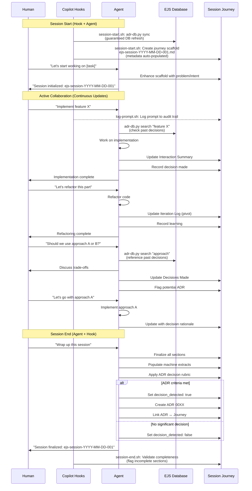
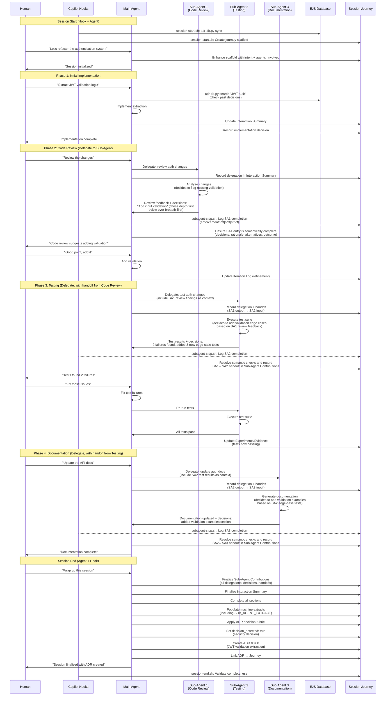
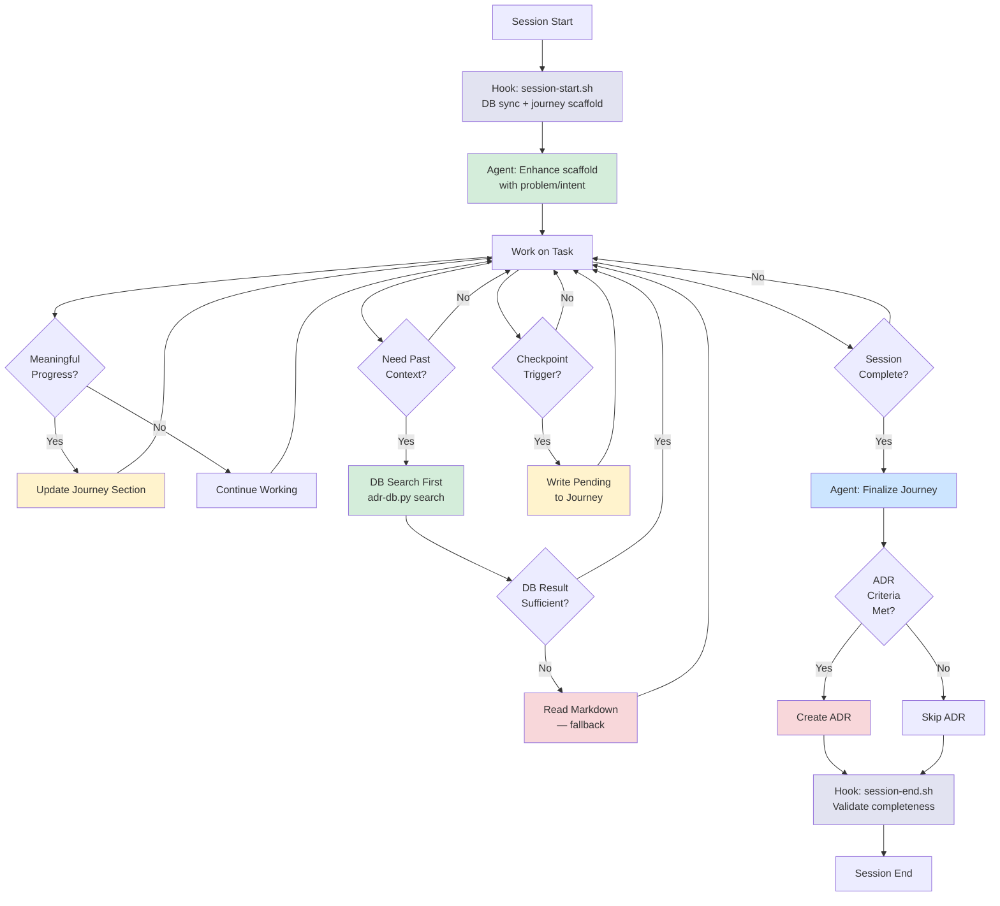
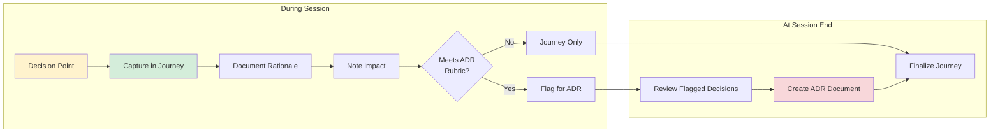
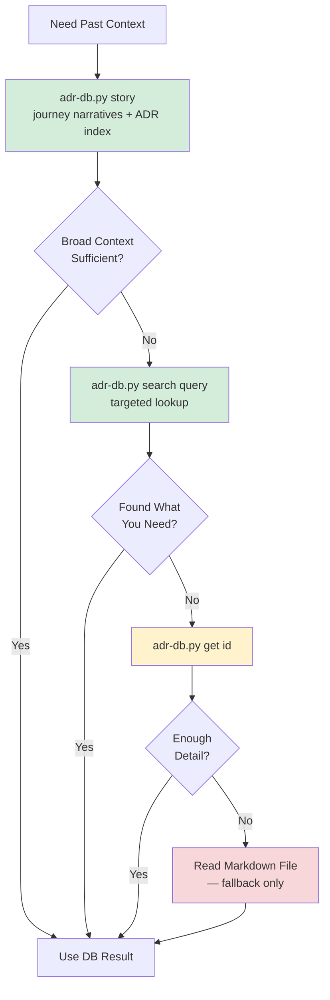
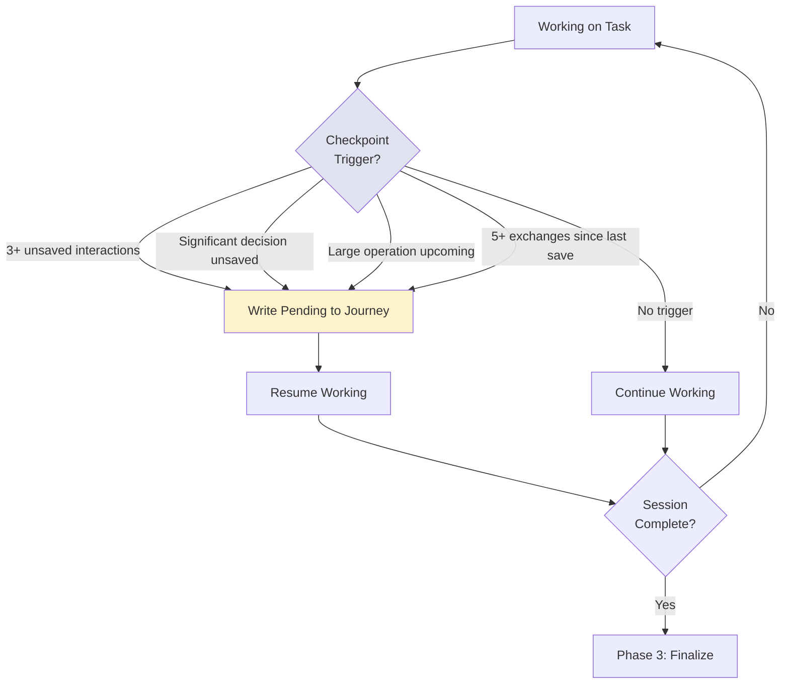

# Session Lifecycle Patterns

## Overview

EJS uses a **start-of-session initialization** with **continuous updates** approach rather than end-of-session reconstruction.

This pattern produces higher-quality documentation by capturing context in real-time as work progresses.

EJS is a **non-competing observer** — it records what agents and humans do without interfering with implementation. Recording happens silently as a side-effect of normal work. How this lifecycle activates depends on the adoption layer:

| Layer | How it activates | Who records |
|-------|-----------------|-------------|
| **Layer 0** (hooks) | Automatic from default branch — `.github/hooks/ejs-hooks.json` | Shell scripts: DB sync, journey scaffold, validation, sub-agent logging |
| **Tier 1** (always-on) | Appended to `copilot-instructions.md` | Whatever agent is active records silently |
| **Tier 2** (bookend) | User invokes `@ejs-journey` at start/end | EJS initializes/finalizes; active agent records in between |
| **Tier 3** (coordinator) | User selects `ejs-journey` from dropdown | EJS delegates to sub-agents and records directly |

The lifecycle phases below apply to all tiers — the difference is which agent performs the recording.

## Layered Architecture

EJS uses four complementary GitHub Copilot customization mechanisms organized in layers:

| Layer | Mechanism | File | Trigger | Purpose |
|-------|-----------|------|---------|---------|
| **Layer 0** | **Copilot Hooks** | `.github/hooks/ejs-hooks.json` | Automatic (platform-managed) | Guaranteed structural automation: DB sync, journey scaffold, validation, sub-agent logging, prompt audit |
| **Layer 1** | **Custom Instructions** | `.github/copilot-instructions.md` | Automatic (always-on) | Compact micro-instruction (~30 lines) — semantic recording contract |
| **Layer 2** | **Agent Skills** | `.github/skills/<name>/SKILL.md` | Automatic (Copilot loads when relevant) | On-demand lifecycle workflows (semantic enrichment) |
| **Layer 3** | **Custom Agent** | `.github/agents/ejs-journey.agent.md` | Manual selection | Observer persona, coordination, Tier 2/3 |

### How Hooks and Skills Divide the Work

Hooks handle **deterministic structural tasks** that must happen every session. Skills handle **semantic tasks** that require LLM reasoning. Together they eliminate the reliability gap — hooks guarantee the foundation, skills enrich it:

| Lifecycle Phase | Hook (Layer 0) | Agent Skill (Layer 2) | Auto-loads when… |
|-----------------|----------------|----------------------|------------------|
| **Session Initialization** | `session-start.sh`: DB sync, journey scaffold, frontmatter | `ejs-session-init`: Problem/Intent, agents_involved, author | User starts a session or begins a new task |
| **Continuous Recording** | `log-prompt.sh`: Prompt audit trail (JSONL) | (handled by custom instructions) | Always active |
| **Sub-Agent Capture** | `subagent-stop.sh`: Timestamped sub-agent entry with semantic enforcement modes (`off|soft|strict`) | `ejs-sub-agent-capture`: Decisions, rationale, handoffs | Main agent delegates to sub-agents |
| **Session Wrap-Up** | `session-end.sh`: Completeness validation | `ejs-session-wrapup`: Finalize sections, machine extracts, ADR rubric | User signals session end |

### Skills vs. Hooks vs. Instructions vs. Agent

- **Copilot Hooks** (Layer 0) guarantee structural tasks run every session regardless of agent compliance — DB sync, file creation, validation, audit logging
- **Custom Instructions** (Layer 1) define the always-on semantic recording contract (~30 lines); templates and skills carry structural detail
- **Agent Skills** (Layer 2) provide detailed workflow steps that load only when relevant — they enrich the hook scaffolds with semantic content
- **Custom Agent** (Layer 3) provides the observer persona and coordination capabilities (Tier 2/3)

Skills are **additive** — they enhance each tier without requiring changes to the agent profile or custom instructions. Hooks are **foundational** — they guarantee structural tasks even when agents don't follow instructions. See [ADR 0014](../adr/0014-agent-skills-for-session-lifecycle.md) for the skills rationale and [ADR 0016](../adr/0016-copilot-hooks-layer-0-structural-automation.md) for the hooks rationale.

## Flow Diagrams

### Single User-Agent Interaction

The following diagram shows a typical EJS session with a single human user and one AI agent:



### Multi-Agent and Sub-Agent Scenario

The following diagram shows a more complex scenario with multiple agents and sub-agents collaborating on a task. Note how the main agent captures each sub-agent's decisions and how inter-agent handoffs are traced:



### Key Differences: Single vs Multi-Agent

| Aspect | Single Agent | Multi-Agent |
|--------|--------------|-------------|
| **Journey Updates** | Main agent updates directly | Main agent consolidates sub-agent inputs |
| **Interaction Summary** | Human ↔ Agent only | Human ↔ Main Agent ↔ Sub-Agents |
| **Agent Collaboration** | N/A | Captured in Agent Collaboration Summary |
| **Sub-Agent Decisions** | N/A | Each sub-agent's decisions captured with rationale in Sub-Agent Contributions |
| **Inter-Agent Handoffs** | N/A | Tracked when one sub-agent's output feeds into another's input |
| **Decision Attribution** | Clear single source | Track which agent contributed to decision |
| **Experiments** | Single agent's attempts | Multiple sub-agent experiments aggregated |
| **Machine Extracts** | Standard 4 extracts | Standard 4 + SUB_AGENT_EXTRACT |
| **Semantic Gating** | Optional | Enforced by mode (`off|soft|strict`) with unresolved thresholds |
| **Complexity** | Linear interaction flow | Parallel/delegated work streams |

### Semantic Enforcement Notes

- `EJS_SEMANTIC_ENFORCEMENT_MODE=off` keeps backward-compatible behavior.
- `EJS_SEMANTIC_ENFORCEMENT_MODE=soft` marks unresolved semantic payloads and surfaces violations.
- `EJS_SEMANTIC_ENFORCEMENT_MODE=strict` requires compliant semantic payloads for resolved sub-agent capture.
- `EJS_SEMANTIC_UNRESOLVED_THRESHOLD` controls how many unresolved sub-agent entries are tolerated before session-end validation marks a journey incomplete.

### Flow Patterns

**Continuous Update Pattern (Both Scenarios):**


**Decision Point Pattern:**


## DB-First Lookup Protocol

When agents need to reference past decisions, journeys, or context, they **must** query the EJS database first. Reading raw markdown files should only be a fallback for additional detail.

### Lookup Order

```
1. adr-db.py story                ← Preferred: full project narrative (journeys + ADR index)
2. adr-db.py search <query>       ← Targeted: fast, context-efficient topic search
3. adr-db.py summary              ← Overview of all ADRs
4. adr-db.py get <id>             ← Full DB record for one ADR/journey
5. Read ejs-docs/adr/*.md         ← Fallback only: when DB results need more detail
6. Read ejs-docs/journey/**/*.md  ← Fallback only: when DB results need more detail
```

### Why DB-First?

| Approach | Context cost | Speed | Use when |
|----------|-------------|-------|----------|
| `adr-db.py story` | Medium (structured narrative) | Fast | Starting a session — need full project context with journey intent, decisions, and ADR index |
| `adr-db.py search` | Low (returns snippets) | Fast | Looking for specific topics, keywords, or decisions |
| `adr-db.py summary` | Medium (compact list) | Fast | Need an overview of all ADRs or journeys |
| `adr-db.py get <id>` | Medium (single record) | Fast | Need full details on a specific known ADR or journey |
| Read markdown files | High (full file content) | Slow | DB results insufficient; need additional sections, formatting, or context not indexed |

### Rules

1. **Always run `adr-db.py sync` at session start** before any queries
2. **Use `story` first** — get the full project narrative (journeys + ADR index) for broad context
3. **Never read markdown files as a first step** when looking for past decisions or context
4. **Use `search` for targeted discovery** — find specific ADRs or journeys by topic
5. **Use `get` for depth** — retrieve full DB record for a specific ADR or journey identified via search
6. **Fall back to markdown files only when** the database record lacks the detail you need (e.g., custom sections, embedded diagrams, full narrative context)

### Flow Diagram



## Sub-Agent Handoff Protocol

When a main agent delegates work to sub-agents, follow this protocol to ensure sub-agent decisions and inter-agent collaboration are captured in the Session Journey.

### When Delegating to a Sub-Agent

1. **Record the delegation** in the Interaction Summary:
   - What task was delegated
   - Which sub-agent was invoked
   - What context or constraints were provided

2. **Provide the sub-agent with context** about prior sub-agent work when relevant (e.g., code review findings passed to the testing agent).

### When a Sub-Agent Completes

3. **Capture the sub-agent's contribution** in the **Sub-Agent Contributions** section:
   - **Task delegated:** What was the sub-agent asked to do?
   - **Decisions made:** What did the sub-agent decide, and why?
   - **Alternatives considered:** What other approaches did the sub-agent evaluate?
   - **Outcome:** What was the result?
   - **Handoff to other agents:** Did this sub-agent's output feed into another sub-agent's work?

### Inter-Agent Collaboration (Handoff Chains)

When one sub-agent's output informs another sub-agent's work, document the chain:

```
SA1 (Code Review) → found missing input validation
  ↓ handoff
SA2 (Testing) → added edge-case tests based on SA1 findings
  ↓ handoff
SA3 (Documentation) → added validation examples based on SA2 test cases
```

Key points:
- Trace the dependency: which sub-agent's output became another's input
- Record if sub-agents disagreed and how conflicts were resolved
- Note which agent ultimately influenced the final decision

### At Session Finalization

4. **Populate `SUB_AGENT_EXTRACT`** in the machine extracts with a structured summary:
   - List each sub-agent involved
   - Summarize their decisions and rationale
   - Document inter-agent handoffs
   - Note any disagreements or conflicts resolved

### Example Sub-Agent Contributions Section

```markdown
## Sub-Agent: Code Review (explore agent)
- **Task delegated:** Review authentication refactor for security and code quality
- **Decisions made:** Flagged missing input validation on JWT claims (chose depth-first security review over breadth-first style review)
- **Alternatives considered:** Could have focused on code style first, but prioritized security given auth context
- **Outcome:** 3 security findings, 1 code quality suggestion
- **Handoff to other agents:** Findings passed to Testing agent as context for edge-case test generation

## Sub-Agent: Testing (task agent)
- **Task delegated:** Run and extend test suite for auth changes, with Code Review findings as context
- **Decisions made:** Added 3 new edge-case tests targeting validation gaps found by Code Review
- **Alternatives considered:** Could have run existing tests only, but SA1 findings warranted new test cases
- **Outcome:** 2 test failures found and fixed, 3 new tests added
- **Handoff to other agents:** Test results and new test cases passed to Documentation agent
```

## Three-Phase Lifecycle

### Phase 1: Session Initialization (Start)

**When:** At the beginning of a new task, feature, or bug fix

**Triggers:**
- "Initialize session"
- "Let's start working on [task]"
- "Create session journey"
- Beginning work on a GitHub issue
- Starting a new feature or refactor

**Actions:**

*Handled by hooks (automatic):*
1. `session-start.sh`: Run `python scripts/adr-db.py sync` to refresh the SQLite index
2. `session-start.sh`: Generate unique session ID: `ejs-session-YYYY-MM-DD-<seq>`
3. `session-start.sh`: Create journey file scaffold from template with structural metadata (session_id, date, repo, branch)

*Handled by agent (semantic):*
4. Populate `author` and `agents_involved` in frontmatter
5. Capture initial **Problem/Intent**
6. Inform user that journey is initialized

**Graceful degradation:** All hooks exit 0 on errors — they never block the agent. If DB sync fails, the session continues without a fresh index. If the journey template is missing, the hook logs a warning and exits cleanly; the agent's `ejs-session-init` skill can create the file manually as a fallback. Hooks only run from the default branch; on feature branches, agents handle initialization fully via instructions and skills.

**Benefits:**
- Clear session boundaries established upfront
- Context captured while fresh
- Reduces cognitive load at session end
- Sets expectations for continuous documentation

### Phase 2: Active Collaboration with Continuous Updates (During)

**When:** Throughout the entire working session

**What to Update:**
1. **Interaction Summary** - Add each meaningful human↔agent exchange as it occurs
   - Format:
     ```
     - Human: <prompt / request>
       - Agent [agent-name]: <response summary>
       - Outcome: <what changed / what was decided>
     ```
   - Attribute every entry by agent name. Capture pivotal questions, constraints, and corrections in real-time

2. **Experiments/Evidence** - Record as experiments happen
   - What was tried
   - What happened
   - What evidence emerged

3. **Iteration Log** - Document pivots when they occur
   - Why the approach changed
   - What triggered the pivot

4. **Decisions Made** - Capture decisions immediately with rationale
   - Decision statement
   - Reason for choosing this approach
   - Expected impact
   - Whether it meets ADR criteria
   - Use `python scripts/adr-db.py search <query>` to reference past decisions efficiently

5. **Key Learnings** - Record insights as they emerge
   - Technical discoveries
   - Prompting strategies that worked well
   - Tooling insights

6. **Sub-Agent Contributions** (multi-agent sessions) - Record after each sub-agent delegation
   - What was delegated and to which sub-agent
   - Sub-agent's decisions with rationale
   - Handoffs between sub-agents

**How Often to Update:**
- After completing a meaningful subtask
- When a decision is made
- After an experiment yields results
- When a pivot or iteration occurs
- After learning something valuable
- After a sub-agent completes delegated work

**Benefits:**
- Accurate collaboration trail (not from memory)
- Context preserved when fresh
- No details lost to time
- Better multi-step/multi-agent session documentation
- Reduced burden at session end

### Phase 2.5: Context-Threshold Checkpointing (Proactive Save)

**When:** During the session, before context runs out

Context-threshold checkpointing is a proactive save mechanism that prevents documentation loss when agent context is consumed faster than the session completes. Instead of relying solely on an explicit session-end signal, agents perform lightweight checkpoint saves during the session.

**Triggers (any one is sufficient):**
- **3+ unsaved interactions** have accumulated since the last journey file write (an interaction is one human prompt and the corresponding agent response)
- A **significant decision** was made but not yet written to the journey file
- A **large, context-intensive operation** is about to start (e.g., reading many files, complex builds, sub-agent delegation)
- **5+ exchanges have occurred** since the last journey file save
- **Substantial work has been completed** but the user has not signalled session end

**Actions:**
1. Write all pending interactions to the **Interaction Summary**
2. Write any pending decisions to the **Decisions Made** section
3. Write any experiments, pivots, or learnings to their respective sections
4. Append only — do not rewrite the entire file
5. Do **not** populate machine extracts (those are finalization-only)
6. Do **not** evaluate the ADR rubric (that is finalization-only)
7. Resume normal work after the checkpoint

**What a Checkpoint Is NOT:**
- Not a full finalization — no machine extracts, no ADR rubric evaluation
- Not a disruption — should be invisible to the user
- Not a replacement for Phase 3 — full finalization still happens at session end

**Flow Diagram:**


**Benefits:**
- Documentation survives unexpected context exhaustion
- No reliance on explicit session-end signals for basic capture
- Lightweight — adds minimal overhead to the workflow
- Insurance policy — if the session ends abruptly, partial documentation exists

### Phase 3: Journey Finalization (End)

**When:** Session is complete and ready to commit

**Triggers:**
- "Wrap up this session"
- "Finalize journey"
- "End session"
- "Ship it"
- "Commit this"
- "Commit and push"

**Actions:**

*Handled by agent (semantic):*
1. Review Session Journey for completeness
2. Finalize all sections with coherent summaries:
   - Complete Interaction Summary
   - Fill in Agent Collaboration Summary
   - Complete Agent Influence section
   - Finalize Experiments/Evidence
   - Complete Iteration Log
   - Ensure all Decisions are documented
   - Complete Key Learnings
   - Fill in "If Repeating This Work"
   - Complete Future Agent Guidance
3. Populate all `## MACHINE EXTRACTS` sections:
   - INTERACTION_EXTRACT
   - DECISIONS_EXTRACT
   - LEARNING_EXTRACT
   - AGENT_GUIDANCE_EXTRACT
   - SUB_AGENT_EXTRACT (if sub-agents were involved)
4. Update `decision_detected` field based on ADR gate criteria
5. Create ADR if decision rubric is met
6. Update `adr_links` in Session Journey if ADR was created
7. Final save of Session Journey

*Handled by hooks (automatic):*
8. `session-end.sh`: Validate that required sections are non-empty
9. `session-end.sh`: Write validation summary as HTML comment in journey footer
10. `session-end.sh`: Create `.ejs-session-incomplete` marker if issues found

**Benefits:**
- Most work already done throughout session
- Final review ensures coherence
- Machine extracts consolidate key information
- ADR decision is clear based on accumulated context

## Key Differences from End-of-Session Approach

### Old Approach (End-of-Session Only)
- ❌ All documentation written at the end
- ❌ Relies on memory and chat history
- ❌ Time-consuming reconstruction effort
- ❌ Details often lost or fuzzy
- ❌ Burden concentrated at session end
- ❌ Temptation to skip or rush documentation

### New Approach (Continuous Updates)
- ✅ Documentation starts immediately
- ✅ Context captured in real-time
- ✅ Incremental, low-overhead updates
- ✅ Accurate, detailed collaboration trail
- ✅ Burden distributed throughout session
- ✅ Session end is quick finalization, not creation

## Prompting Patterns for Agents

### At Session Start
```
"Initialize session for [task description]"
"Let's start working on [feature/bug]. Create the session journey."
"Begin session: [problem statement]"
```

### During Session (Silent — No Prompting)
Agents silently update the Session Journey as a side-effect of normal work when:
- A decision is made
- An experiment completes
- A pivot occurs
- A learning emerges
- A meaningful interaction occurs

No explicit prompt needed — the agent records automatically without asking the user. This is the core EJS contract: **capture without interrupting**.

### Explicitly Request Update (Optional)
```
"Update the session journey with our recent progress"
"Document this decision in the journey"
"Add this learning to the session journey"
```

### At Session End
```
"Wrap up this session"
"Finalize the journey"
"End session and create ADR if needed"
```

## Implementation Guidance for Agents

### Session Initialization
1. Run `python scripts/adr-db.py sync` to refresh the SQLite index
2. Check for existing session journey for today
3. Increment sequence number if needed
4. Use template from `ejs-docs/journey/_templates/journey-template.md`
5. Populate initial metadata accurately
6. Write problem/intent clearly
7. Confirm creation with user

### Referencing Past Decisions (DB-First)
1. Always query `adr-db.py search <query>` before reading raw markdown files
2. Use `adr-db.py summary` or `adr-db.py summary-journeys` for overviews
3. Use `adr-db.py get <id>` for full details on a specific record
4. Fall back to reading markdown files **only** when DB results lack the needed detail

### Continuous Updates
1. Keep updates atomic and focused
2. Don't rewrite entire journey each time
3. Append to relevant sections
4. Maintain chronological order in Interaction Summary
5. Keep format consistent
6. Save after each meaningful update

### Context-Threshold Checkpointing
1. Monitor for checkpoint triggers (3+ unsaved interactions, unsaved decisions, large operations upcoming, context getting large)
2. Write all pending content to the journey file when a trigger fires
3. Append only — do not rewrite the entire file
4. Do not populate machine extracts or evaluate the ADR rubric during checkpoints
5. Resume normal work after the checkpoint

### Journey Finalization
1. Read current journey state
2. Fill any gaps in sections
3. Ensure coherence across sections
4. Populate machine extracts accurately
5. Apply ADR decision rubric objectively
6. Create ADR only when truly warranted
7. Link ADR ↔ Journey bidirectionally

## Example Session Flow

```
Human: "Let's start working on refactoring the authentication module"
Agent [Copilot]: Runs `adr-db.py sync` to refresh the index
                 Creates ejs-docs/journey/2026/ejs-session-2026-02-07-01.md
                 Populates metadata and initial problem/intent
                 "Session initialized: ejs-session-2026-02-07-01"

[Work begins]
Human: "Extract the JWT validation into a separate function"
Agent [Copilot]: Runs `adr-db.py search "JWT"` to check past decisions
                 Implements the refactoring
                 Silently updates Interaction Summary in session journey
                 Silently updates Iteration Log

[More work]
Human: "Should we use bcrypt or argon2 for password hashing?"
Agent [Copilot]: Runs `adr-db.py search "password hashing"` for prior context
                 Discusses trade-offs (security vs. performance)
                 Silently updates Decisions Made in session journey
                 Flags as potential ADR candidate (security decision)

[More work]
Human: "Actually, let's stick with bcrypt for now since it's already in use"
Agent [Copilot]: Implements decision
                 Silently updates Decisions Made with rationale (consistency)
                 Silently updates Iteration Log (pivot from argon2 consideration)

[Session wraps up]
Human: "Wrap up this session"
Agent [Copilot]: Finalizes Session Journey
                 - Completes all sections
                 - Populates machine extracts
                 - Reviews ADR criteria (decision on bcrypt = significant enough? No, minor)
                 - Sets decision_detected: false
                 - No ADR created
                 "Session finalized: ejs-session-2026-02-07-01"
```

## Anti-Patterns to Avoid

### Don't Wait Until the End
❌ **Wrong:** Capture everything at session end from memory
✅ **Right:** Update journey incrementally throughout session

### Don't Overwrite, Append
❌ **Wrong:** Rewrite entire journey file each update
✅ **Right:** Append to existing sections, maintaining structure

### Don't Skip Important Context
❌ **Wrong:** "I'll remember this detail for later"
✅ **Right:** Document immediately while context is fresh

### Don't Create ADRs for Everything
❌ **Wrong:** Every decision triggers an ADR
✅ **Right:** Apply the ADR rubric objectively; most decisions stay in journey only

### Don't Ignore Mid-Session Pivots
❌ **Wrong:** Only document the final approach
✅ **Right:** Capture what was tried, why it changed, what evidence led to the pivot

### Don't Read Markdown Files First
❌ **Wrong:** Read `ejs-docs/adr/*.md` or `ejs-docs/journey/**/*.md` to find past context
✅ **Right:** Query `adr-db.py search` first; only read markdown files when the DB result needs more detail

### Don't Rely Solely on Session-End Signals
❌ **Wrong:** Wait for "wrap up" or "commit" before writing any documentation to the journey file
✅ **Right:** Perform checkpoint saves during the session when context is accumulating

## Success Metrics

A well-managed session journey should:
- ✅ Be readable as a standalone narrative
- ✅ Contain an accurate chronological collaboration trail
- ✅ Explain "why" for all major decisions
- ✅ Capture experiments and their outcomes
- ✅ Record learnings for future reuse
- ✅ Be mostly complete before session end (not a reconstruction effort)
- ✅ Have populated machine extracts for downstream parsing

## Migration from End-of-Session Approach

If adopting this pattern from the old end-of-session approach:

1. **Start new sessions with initialization**
   - Don't worry about retroactively updating old journeys
   - New sessions use the three-phase lifecycle

2. **Train the habit of continuous updates**
   - Start small: update after each major task
   - Gradually increase frequency as it becomes natural
   - Use explicit prompts at first ("update journey") until automatic

3. **Keep ADR gate standards consistent**
   - Same rubric applies whether decision made at start, middle, or end
   - Don't create more ADRs just because you're documenting more

4. **Celebrate reduced end-of-session burden**
   - Notice how finalization becomes quick review vs. full creation
   - Enjoy better documentation quality from real-time capture